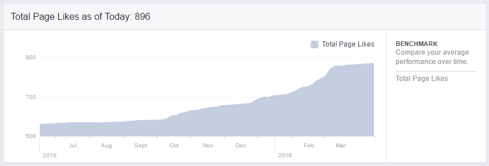

    

The <b>Central European Games Conference</b> is an international event for developers, entrepreneurs, industry experts and gaming enthusiasts to gather in the city of Vienna, not only to talk about games but also to showcase their projects, listen to leading experts in the field and ultimately drive forward the Central European Games Sector.

      
## Background
In order to promote the conference, we regularly held meetings within the team to keep up-to-date with tasks and to have an overview of the goals we want to achieve. The goals included the promotion of the conference through our social media channels (Facebook and Twitter). The management of these channels included announcement posts for the second edition of the conference, promotion for tickets, information on location, date and speakers, and ultimately engagement with our followers and the central european games community. I managed the accounts from June 2015 until March 2016.

## Strategy
The focus of our social media strategy was based on organic growth and strong user engagement. It involved concentrating on reaching the right audience with the right content without the use of paid marketing and answering any questions regarding the conference that our audience may have.
 We created a marketing campaign four months before the conference start, in order to reach more potential attendees.

## Accomplishments

During the timeframe June 2015 - March 2016:
 
Active engagement and relevant content research led to a 55% increase in likes for our CEGC facebook channel and a 125% increase in followers for our CEGC twitter channel.

 
Engagement varied depending on type of posts.

 
Our posts had varying spikes of high reach - mostly focused before, during and after the conference throughout a period of about 3 months.
 
Not shown in the graph is a spike due to paid reach in October (our advertisement post reached about 45 000 people).

 

<blockquote class="twitter-tweet" data-lang="en">
This is <a href="https://twitter.com/meowstations">@meowstations</a>, our super awesome <a href="https://twitter.com/hashtag/socialmedia?src=hash">#socialmedia</a> manager for <a href="https://twitter.com/CEGConf">@CEGConf</a>!! <a href="https://twitter.com/hashtag/CEGC2016?src=hash">#CEGC2016</a> <a href="https://t.co/v28s0bbzwf">pic.twitter.com/v28s0bbzwf</a>
&mdash; Mariebeth Aquino (@gadgeeked) <a href="https://twitter.com/gadgeeked/status/700325365932277760">February 18, 2016</a></blockquote>

<blockquote class="twitter-tweet" data-lang="en">
Are you wondering who wrote all the amazing tweets <a href="https://twitter.com/CEGConf">@CEGConf</a>? It was the lovely <a href="https://twitter.com/meowstations">@meowstations</a>! :D Thank you! <a href="https://twitter.com/hashtag/CEGC2016?src=hash">#CEGC2016</a>
&mdash; Thomas Müller (@SpeedyBrain) <a href="https://twitter.com/SpeedyBrain/status/700735519416684545">February 19, 2016</a></blockquote>

## Sample Posts

<blockquote class="twitter-tweet" data-lang="en">
Everyone is getting ready in the indie expo! Opening at 10 today! <a href="https://twitter.com/hashtag/gamedev?src=hash">#gamedev</a> <a href="https://twitter.com/hashtag/indiedev?src=hash">#indiedev</a> <a href="https://twitter.com/hashtag/CEGC2016?src=hash">#CEGC2016</a> <a href="https://t.co/SSTumi5DAL">pic.twitter.com/SSTumi5DAL</a>
&mdash; CEGConf (@CEGConf) <a href="https://twitter.com/CEGConf/status/700238093186699264">February 18, 2016</a></blockquote>

<blockquote class="twitter-tweet" data-lang="en">
VODs for <a href="https://twitter.com/hashtag/CEGC2016?src=hash">#CEGC2016</a> will be up on our YouTube channel soon. For now we have raw footage of the <a href="https://twitter.com/UnrealEngine">@UnrealEngine</a> Track! <a href="https://t.co/gEK4mbIoCf">https://t.co/gEK4mbIoCf</a>
&mdash; CEGConf (@CEGConf) <a href="https://twitter.com/CEGConf/status/701043817047310337">February 20, 2016</a></blockquote>

<blockquote class="twitter-tweet" data-lang="en">
&quot;We want to make AI to dominate the world&quot; <a href="https://twitter.com/marek_rosa">@marek_rosa</a>. You heard it here first ;) <a href="https://twitter.com/hashtag/worlddomination?src=hash">#worlddomination</a> <a href="https://twitter.com/hashtag/CEGC2016?src=hash">#CEGC2016</a>
&mdash; CEGConf (@CEGConf) <a href="https://twitter.com/CEGConf/status/700347563736702976">February 18, 2016</a></blockquote>

<blockquote class="twitter-tweet" data-lang="en">
If you want to have <a href="https://twitter.com/hashtag/diversity?src=hash">#diversity</a> in your games, is it enough to just have representation? Does it even change the world? <a href="https://twitter.com/hashtag/gamedev?src=hash">#gamedev</a> <a href="https://twitter.com/hashtag/CEGC2016?src=hash">#CEGC2016</a>
&mdash; CEGConf (@CEGConf) <a href="https://twitter.com/CEGConf/status/700651567624486912">February 19, 2016</a></blockquote>

<blockquote class="twitter-tweet" data-lang="en">
Tina Merry talking <a href="https://twitter.com/hashtag/career?src=hash">#career</a> development in the <a href="https://twitter.com/hashtag/games?src=hash">#games</a> industry. Not with us? Follow it on <a href="https://twitter.com/Twitch">@twitch</a>! <a href="https://t.co/KliH4ptPpL">https://t.co/KliH4ptPpL</a> <a href="https://twitter.com/hashtag/twitch?src=hash">#twitch</a> <a href="https://twitter.com/hashtag/CEGC2016?src=hash">#CEGC2016</a>
&mdash; CEGConf (@CEGConf) <a href="https://twitter.com/CEGConf/status/700260371773444096">February 18, 2016</a></blockquote>

<blockquote class="twitter-tweet" data-lang="en">
Our <a href="https://twitter.com/Twitch">@twitch</a> stream is live! Follow it on <a href="https://t.co/KliH4ptPpL">https://t.co/KliH4ptPpL</a> :) <a href="https://twitter.com/hashtag/CEGC2016?src=hash">#CEGC2016</a> <a href="https://t.co/Wf5EogGzEm">pic.twitter.com/Wf5EogGzEm</a>
&mdash; CEGConf (@CEGConf) <a href="https://twitter.com/CEGConf/status/700606003889512448">February 19, 2016</a></blockquote>

<blockquote class="twitter-tweet" data-lang="en">
Good to see so many people enjoying the <a href="https://twitter.com/UnrealEngine">@UnrealEngine</a> &amp; <a href="https://twitter.com/hashtag/CEGC2016?src=hash">#CEGC2016</a> reception! Thanks <a href="https://twitter.com/vrei_">@vrei_</a> for the awesome location! <a href="https://t.co/lUT6qCJSdJ">pic.twitter.com/lUT6qCJSdJ</a>
&mdash; CEGConf (@CEGConf) <a href="https://twitter.com/CEGConf/status/700031953337237506">February 17, 2016</a></blockquote>

<blockquote class="twitter-tweet" data-lang="en">
Head on over to Schwarzberg Bar for the <a href="https://twitter.com/hashtag/wig?src=hash">#wig</a> and <a href="https://twitter.com/hashtag/diversity?src=hash">#diversity</a> reception! 🎆 everyone is welcome 🎉 <a href="https://twitter.com/hashtag/CEGC2016?src=hash">#CEGC2016</a>
&mdash; CEGConf (@CEGConf) <a href="https://twitter.com/CEGConf/status/700724521465204736">February 19, 2016</a></blockquote>

